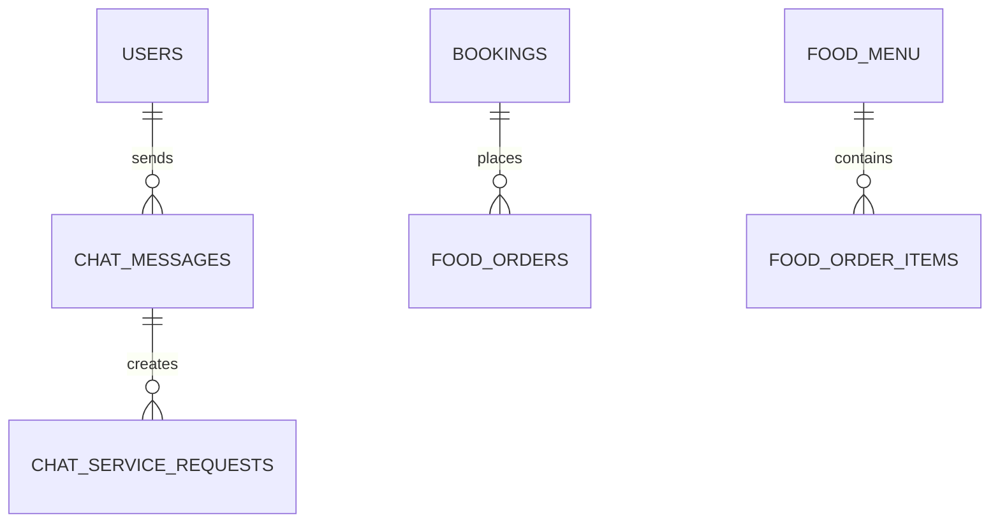

# Hotel Management System API Documentation

## Table of Contents
1. [Authentication](#authentication)
2. [Rooms](#rooms)
3. [Guests](#guests)
4. [Bookings](#bookings)
5. [Payments](#payments)
6. [Services](#services)
7. [Food Menu & Orders](#food-menu--orders)
8. [Real-time Features](#real-time-features)

## Base URL
```
http://localhost:3000/api
```

## Authentication

All API endpoints (except login and register) require JWT authentication. Include the token in the Authorization header:
```
Authorization: Bearer your-jwt-token
```

### Register New User
```http
POST /auth/register
```

**Request Body:**
```json
{
    "username": "john_doe",
    "password": "secure_password123",
    "role": "staff"  // "admin", "staff", or "user"
}
```

**Response (201):**
```json
{
    "message": "User registered successfully",
    "token": "jwt_token_here"
}
```

### Login
```http
POST /auth/login
```

**Request Body:**
```json
{
    "username": "john_doe",
    "password": "secure_password123"
}
```

**Response (200):**
```json
{
    "message": "Login successful",
    "token": "jwt_token_here"
}
```

### Get Current User
```http
GET /auth/me
```

**Response (200):**
```json
{
    "user_id": 1,
    "username": "john_doe",
    "role": "staff"
}
```

## Rooms

### List All Rooms
```http
GET /rooms
```

**Response (200):**
```json
[
    {
        "room_id": 1,
        "room_number": "101",
        "room_type": "Deluxe",
        "rate_per_night": 150.00,
        "status": "available",
        "amenities": ["TV", "AC", "Mini Bar"],
        "created_at": "2025-01-19T10:00:00.000Z"
    }
]
```

### Get Available Rooms
```http
GET /rooms/available?check_in_date=2025-01-20&check_out_date=2025-01-25
```

**Query Parameters:**
- check_in_date (required): ISO date string
- check_out_date (required): ISO date string

**Response (200):**
```json
[
    {
        "room_id": 1,
        "room_number": "101",
        "room_type": "Deluxe",
        "rate_per_night": 150.00,
        "status": "available",
        "amenities": ["TV", "AC", "Mini Bar"]
    }
]
```

### Get Single Room
```http
GET /rooms/:id
```

**Response (200):**
```json
{
    "room_id": 1,
    "room_number": "101",
    "room_type": "Deluxe",
    "rate_per_night": 150.00,
    "status": "available",
    "amenities": ["TV", "AC", "Mini Bar"],
    "created_at": "2025-01-19T10:00:00.000Z"
}
```

### Create Room (Admin Only)
```http
POST /rooms
```

**Request Body:**
```json
{
    "room_number": "101",
    "room_type": "Deluxe",
    "rate_per_night": 150.00,
    "amenities": ["TV", "AC", "Mini Bar"]
}
```

**Response (201):**
```json
{
    "message": "Room created successfully",
    "roomId": 1
}
```

### Update Room (Admin Only)
```http
PUT /rooms/:id
```

**Request Body:**
```json
{
    "room_type": "Super Deluxe",
    "rate_per_night": 180.00,
    "status": "maintenance"
}
```

**Response (200):**
```json
{
    "message": "Room updated successfully"
}
```

## Guests

### List All Guests
```http
GET /guests
```

**Response (200):**
```json
[
    {
        "guest_id": 1,
        "first_name": "John",
        "last_name": "Doe",
        "email": "john@example.com",
        "phone": "+1234567890",
        "address": "123 Main St",
        "id_proof_type": "passport",
        "id_proof_number": "AB123456",
        "created_at": "2025-01-19T10:00:00.000Z"
    }
]
```

### Get Guest Details
```http
GET /guests/:id
```

**Response (200):**
```json
{
    "guest_id": 1,
    "first_name": "John",
    "last_name": "Doe",
    "email": "john@example.com",
    "phone": "+1234567890",
    "address": "123 Main St",
    "id_proof_type": "passport",
    "id_proof_number": "AB123456",
    "created_at": "2025-01-19T10:00:00.000Z",
    "bookings": [
        {
            "booking_id": 1,
            "room_id": 101,
            "check_in_date": "2025-01-20",
            "check_out_date": "2025-01-25",
            "booking_status": "confirmed",
            "payment_status": "partial"
        }
    ]
}
```

### Register New Guest
```http
POST /guests
```

**Request Body:**
```json
{
    "first_name": "John",
    "last_name": "Doe",
    "email": "john@example.com",
    "phone": "+1234567890",
    "address": "123 Main St",
    "id_proof_type": "passport",
    "id_proof_number": "AB123456"
}
```

**Response (201):**
```json
{
    "message": "Guest registered successfully",
    "guestId": 1
}
```

### Search Guests
```http
GET /guests/search/query?term=john
```

**Query Parameters:**
- term (required): Search term for name, email, or phone

**Response (200):**
```json
[
    {
        "guest_id": 1,
        "first_name": "John",
        "last_name": "Doe",
        "email": "john@example.com",
        "phone": "+1234567890"
    }
]
```

## Bookings

### Create Booking
```http
POST /bookings
```

**Request Body:**
```json
{
    "guest_id": 1,
    "room_id": 101,
    "check_in_date": "2025-01-20",
    "check_out_date": "2025-01-25",
    "total_amount": 750.00
}
```

**Response (201):**
```json
{
    "message": "Booking created successfully",
    "bookingId": 1
}
```

### Get Booking Details
```http
GET /bookings/:id
```

**Response (200):**
```json
{
    "booking_id": 1,
    "guest_id": 1,
    "room_id": 101,
    "check_in_date": "2025-01-20",
    "check_out_date": "2025-01-25",
    "booking_status": "confirmed",
    "total_amount": 750.00,
    "payment_status": "pending",
    "created_at": "2025-01-19T10:00:00.000Z",
    "first_name": "John",
    "last_name": "Doe",
    "email": "john@example.com",
    "room_number": "101",
    "room_type": "Deluxe",
    "payments": [
        {
            "payment_id": 1,
            "amount": 375.00,
            "payment_method": "card",
            "payment_date": "2025-01-19T10:30:00.000Z",
            "payment_status": "completed",
            "transaction_id": "txn_123456"
        }
    ]
}
```

### Update Booking Status
```http
PUT /bookings/:id/status
```

**Request Body:**
```json
{
    "status": "checked_in"  // confirmed, checked_in, checked_out, cancelled
}
```

**Response (200):**
```json
{
    "message": "Booking status updated successfully"
}
```

## Payments

### Record Payment
```http
POST /payments
```

**Request Body:**
```json
{
    "booking_id": 1,
    "amount": 375.00,
    "payment_method": "card",
    "transaction_id": "txn_123456"
}
```

**Response (201):**
```json
{
    "message": "Payment recorded successfully",
    "paymentId": 1,
    "paymentStatus": "completed"
}
```

### Get Payment Statistics (Admin Only)
```http
GET /payments/stats/summary
```

**Response (200):**
```json
{
    "total_payments": 100,
    "total_amount": 50000.00,
    "average_amount": 500.00,
    "completed_payments": 80,
    "pending_payments": 15,
    "failed_payments": 5,
    "total_completed_amount": 40000.00
}
```

## Services

### Create Service Request
```http
POST /services/request
```

**Request Body:**
```json
{
    "booking_id": 1,
    "service_id": 1,
    "notes": "Extra towels needed"
}
```

**Response (201):**
```json
{
    "message": "Service request created successfully",
    "requestId": 1
}
```

### Get Pending Service Requests (Staff Only)
```http
GET /services/requests/pending
```

**Response (200):**
```json
[
    {
        "request_id": 1,
        "service_name": "Room Cleaning",
        "room_number": "101",
        "first_name": "John",
        "last_name": "Doe",
        "request_date": "2025-01-19T11:00:00.000Z",
        "status": "pending",
        "notes": "Extra towels needed"
    }
]
```

## Food Menu & Orders

### Get Menu Items
```http
GET /food/menu
```

**Response (200):**
```json
[
    {
        "item_id": 1,
        "name": "Chicken Burger",
        "description": "Grilled chicken with fresh vegetables",
        "price": 12.99,
        "category": "Main Course",
        "availability": true
    }
]
```

### Create Food Order
```http
POST /food/orders
```

**Request Body:**
```json
{
    "booking_id": 1,
    "guest_id": 1,
    "room_id": 101,
    "items": [
        {
            "item_id": 1,
            "quantity": 2,
            "notes": "Extra cheese"
        }
    ],
    "notes": "Deliver to room 101"
}
```

**Response (201):**
```json
{
    "message": "Order created successfully",
    "orderId": 1,
    "totalAmount": 25.98
}
```

## Real-time Features

### Socket.IO Events

#### Client Events

1. Authenticate Connection
```javascript
socket.emit('authenticate', {
    userId: 1,
    userType: 'guest',
    token: 'jwt_token_here'
});
```

2. Send Private Message
```javascript
socket.emit('private_message', {
    senderId: 1,
    senderType: 'guest',
    receiverId: 2,
    receiverType: 'staff',
    message: 'Hello, I need assistance',
    messageType: 'text'
});
```

3. Create Service Request
```javascript
socket.emit('service_request', {
    senderId: 1,
    serviceType: 'room_cleaning',
    notes: 'Need room cleaning service'
});
```

4. Place Food Order
```javascript
socket.emit('food_order', {
    bookingId: 1,
    guestId: 1,
    roomId: 101,
    items: [
        {
            itemId: 1,
            quantity: 2,
            notes: 'Extra spicy'
        }
    ],
    notes: 'Urgent delivery'
});
```

#### Server Events

1. Authentication Response
```javascript
socket.on('authenticated', (data) => {
    // data: { status: 'success' }
});
```

2. Chat History
```javascript
socket.on('chat_history', (messages) => {
    // messages: array of previous chat messages
});
```

3. New Message
```javascript
socket.on('new_message', (message) => {
    // message: { messageId, senderId, message, timestamp, etc. }
});
```

4. Service Request Status
```javascript
socket.on('service_request_created', (data) => {
    // data: { messageId, serviceType, status }
});
```

5. Food Order Status
```javascript
socket.on('food_order_created', (data) => {
    // data: { orderId, status, totalAmount }
});
```

### Error Responses

All endpoints may return the following error responses:

**400 Bad Request:**
```json
{
    "error": "Error message describing the issue"
}
```

**401 Unauthorized:**
```json
{
    "error": "Access token is required"
}
```

**403 Forbidden:**
```json
{
    "error": "User not authorized for this action"
}
```

**404 Not Found:**
```json
{
    "error": "Resource not found"
}
```

**500 Server Error:**
```json
{
    "error": "Something went wrong!"
}
```

## Rate Limiting

API endpoints are rate-limited to prevent abuse. The current limits are:
- 100 requests per minute for authenticated users
- 20 requests per minute for unauthenticated users

When rate limit is exceeded, the API returns:
```json
{
    "error": "Too many requests",
    "retryAfter": 60
}
```

## Pagination

List endpoints support pagination using query parameters:
- page: Page number (default: 1)
- limit: Items per page (default: 10, max: 100)

Example:
```http
GET /bookings?page=2&limit=20
```

Response includes pagination metadata:
```json
{
    "data": [...],
    "pagination": {
        "currentPage": 2,
        "totalPages": 5,
        "totalItems": 100,
        "itemsPerPage": 20
    }
}

## Error Handling

### HTTP Status Codes

| Status Code | Description | Example Scenarios |
|------------|-------------|-------------------|
| 200 | OK | Successful GET, PUT requests |
| 201 | Created | Successful POST requests |
| 400 | Bad Request | Invalid input, validation errors |
| 401 | Unauthorized | Missing or invalid token |
| 403 | Forbidden | Insufficient permissions |
| 404 | Not Found | Resource doesn't exist |
| 409 | Conflict | Duplicate entry |
| 429 | Too Many Requests | Rate limit exceeded |
| 500 | Internal Server Error | Server-side errors |

### Common Error Responses

1. **Validation Error (400)**
```json
{
    "error": "Validation failed",
    "details": {
        "field": "email",
        "message": "Invalid email format"
    }
}
```

2. **Authentication Error (401)**
```json
{
    "error": "Access token is required"
}
```

3. **Permission Error (403)**
```json
{
    "error": "User not authorized for this action",
    "requiredRole": "admin"
}
```

4. **Resource Not Found (404)**
```json
{
    "error": "Resource not found",
    "resource": "booking",
    "id": "123"
}
```

5. **Rate Limit Error (429)**
```json
{
    "error": "Too many requests",
    "retryAfter": 60,
    "limit": "100 requests per minute"
}
```

## Rate Limiting

### Limits by Route Type

| Route Type | Authenticated | Unauthenticated |
|------------|---------------|-----------------|
| GET requests | 100/minute | 20/minute |
| POST requests | 50/minute | 10/minute |
| PUT/DELETE requests | 30/minute | Not allowed |

### Rate Limit Headers

Response headers include rate limit information:
```
X-RateLimit-Limit: 100
X-RateLimit-Remaining: 95
X-RateLimit-Reset: 1706025600
```

### Burst Handling

Short bursts of requests are allowed within reasonable limits:
- Up to 20 requests in 1 second
- Up to 50 requests in 10 seconds
- Regular limits apply for longer periods

## Pagination

### Request Parameters

All list endpoints support the following pagination parameters:

| Parameter | Type | Default | Description |
|-----------|------|---------|-------------|
| page | integer | 1 | Page number |
| limit | integer | 10 | Items per page (max: 100) |
| sort | string | id | Field to sort by |
| order | string | desc | Sort order (asc/desc) |

### Example Request
```http
GET /api/bookings?page=2&limit=20&sort=check_in_date&order=desc
```

### Response Format
```json
{
    "data": [...],
    "pagination": {
        "currentPage": 2,
        "totalPages": 5,
        "totalItems": 100,
        "itemsPerPage": 20,
        "hasNextPage": true,
        "hasPrevPage": true
    },
    "links": {
        "first": "/api/bookings?page=1&limit=20",
        "prev": "/api/bookings?page=1&limit=20",
        "next": "/api/bookings?page=3&limit=20",
        "last": "/api/bookings?page=5&limit=20"
    }
}
```

## Database Schema

### Tables Overview

1. **Users**
```sql
CREATE TABLE users (
    user_id INTEGER PRIMARY KEY AUTOINCREMENT,
    username TEXT NOT NULL UNIQUE,
    password TEXT NOT NULL,
    role TEXT NOT NULL,
    created_at TIMESTAMP DEFAULT CURRENT_TIMESTAMP
);
```

2. **Chat Messages**
```sql
CREATE TABLE chat_messages (
    message_id INTEGER PRIMARY KEY AUTOINCREMENT,
    sender_id INTEGER NOT NULL,
    sender_type TEXT NOT NULL,
    receiver_id INTEGER NOT NULL,
    receiver_type TEXT NOT NULL,
    message TEXT NOT NULL,
    message_type TEXT DEFAULT 'text',
    status TEXT DEFAULT 'sent',
    created_at TIMESTAMP DEFAULT CURRENT_TIMESTAMP
);
```

3. **Service Requests**
```sql
CREATE TABLE chat_service_requests (
    request_id INTEGER PRIMARY KEY AUTOINCREMENT,
    message_id INTEGER NOT NULL,
    service_type TEXT NOT NULL,
    status TEXT DEFAULT 'pending',
    notes TEXT,
    created_at TIMESTAMP DEFAULT CURRENT_TIMESTAMP,
    FOREIGN KEY (message_id) REFERENCES chat_messages(message_id)
);
```

4. **Food Menu**
```sql
CREATE TABLE food_menu (
    item_id INTEGER PRIMARY KEY AUTOINCREMENT,
    name TEXT NOT NULL,
    description TEXT,
    price DECIMAL NOT NULL,
    category TEXT NOT NULL,
    availability BOOLEAN DEFAULT 1,
    created_at TIMESTAMP DEFAULT CURRENT_TIMESTAMP
);
```

### Relationships



## API Versioning

The API uses URL versioning. Current version: v1
```
http://localhost:3000/api/v1/
```

Future versions will be available at `/api/v2/`, etc.

### Version Lifecycle

| Version | Status | End of Life |
|---------|--------|-------------|
| v1 | Current | Active |
| v2 | Planning | - |

### Deprecation Policy

- 6 months notice before deprecating any API version
- Deprecated versions remain available for 3 months
- Security updates only during deprecation period

## Testing

### Running Tests
```bash
npm test
```

### Coverage Report
```bash
npm run test:coverage
```
